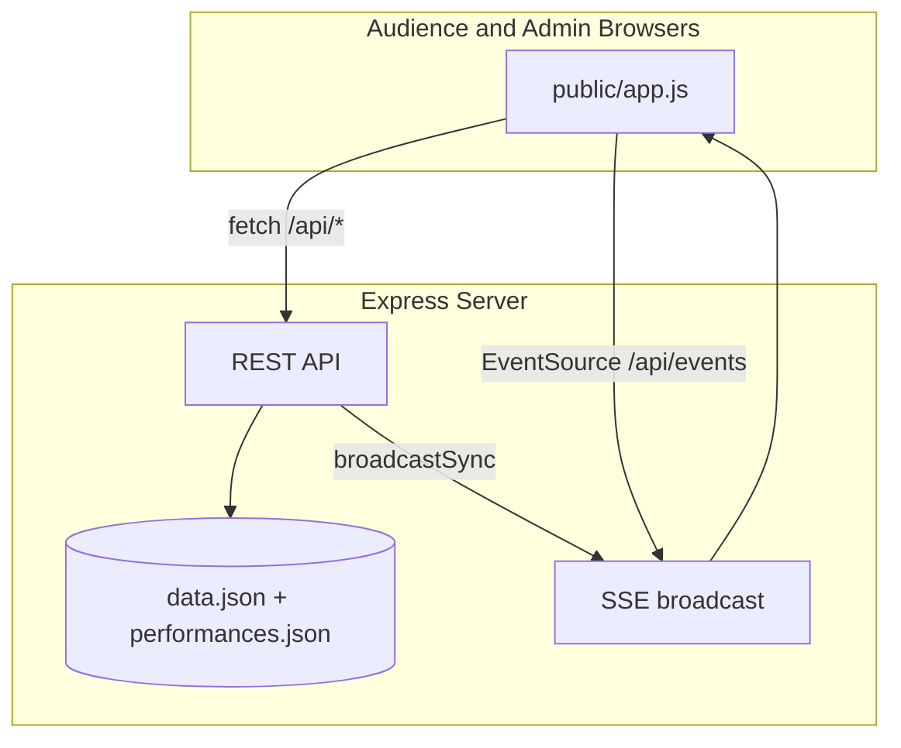

# Talent Show Voting App

Real-time voting, feedback, and show control for live school talent shows. Built and deployed for a ~100-person event in 2026; this repository is the production codebase, adapted for public release.

> **Disclaimer:** Not officially affiliated with WCPSS or Panther Creek High School.

## About this release

This project was used to run a live talent show end-to-end: audience devices followed the admin-controlled phase (waiting → performing → voting), with ranked votes, superlatives, per-performance feedback, and results.

For the public repo I:

- Removed other performers’ personal data from the sample program (kept **Orange Jasmine** as the real portfolio entry)
- Added placeholder demo acts (`NAME HERE` / `TYPE HERE`, plus fun examples) so others can fork and customize
- Required `ADMIN_PASSWORD` via environment variable (no hardcoded secrets in code)
- Kept a **private local archive** (`private-archive/`, gitignored) with the full show backup on my machine

## Screenshots

_Screenshots coming soon — capture from localhost and add to `docs/screenshots/`._

| | |
|---|---|
| Login | _pending_ |
| Program | _pending_ |
| Performing | _pending_ |
| Voting | _pending_ |
| Admin | _pending_ |

## Features

**Audience**

- Join with first/last name and device fingerprint
- Live program list with intermission indicator
- Synced performance view (follows admin “Next” / phase changes)
- Per-performance feedback
- Ranked voting (top 5) + superlatives
- “Already voted” state with optional next-show feedback

**Admin**

- Single-owner admin panel (password-protected)
- Phase control: Waiting, Performing, Open Voting
- Performance CRUD and reorder
- Media upload (local disk or Tigris S3)
- Results: top 3, full rankings, voter list
- Reset data / complete reset (forces re-login on all devices)

**Technical**

- Server-Sent Events (SSE) for live sync across devices
- Polling fallback + revision timestamps to avoid stale state
- Multi-layer vote deduplication (cookie, fingerprint, hardware fingerprint, name)
- JSON file persistence with optional Fly.io volume at `/data`

## Tech stack

- **Backend:** Node.js, Express
- **Frontend:** Vanilla HTML/CSS/JS
- **Realtime:** SSE (`/api/events`)
- **Storage:** JSON files (`data.json`, `performances.json`); optional AWS S3-compatible (Tigris) for uploads
- **Deploy:** Fly.io (single machine + persistent volume)

## Architecture (brief)



Admin actions mutate the DB, bump a revision timestamp, and push an atomic `sync` payload to all connected clients.

## Run locally

```bash
npm install
```

**Windows (PowerShell):**

```powershell
$env:ADMIN_PASSWORD="your-secret-password"
npm start
# or if port 3000 is busy:
npm run dev:3001
```

**macOS / Linux:**

```bash
ADMIN_PASSWORD=your-secret-password npm start
PORT=3001 npm start   # alternate port
```

Open [http://localhost:3000](http://localhost:3000) (or `:3001`).

Sample performances are in `performances.json`. Runtime state is written to `data.json` (created on first run, gitignored).

## Deploy (optional)

1. Install [Fly CLI](https://fly.io/docs/hands-on/install-flyctl/) and log in
2. Set secret: `fly secrets set ADMIN_PASSWORD=your-secret-password -a your-app`
3. Configure a volume mount at `/data` (see `fly.toml`)
4. `fly deploy`

Scale to zero when not in use: `fly scale count 0 -a your-app`

## What I'd improve in retrospect

- Voting edge cases: occasional false “already voted” from hardware fingerprint collisions at a shared venue
- `Unknown` voter names when a vote arrives without a matching device join record
- Stronger admin session handling without relying on a single device owner
- Automated tests for sync revision logic and vote deduplication
- UI polish (layout, mobile refinements) — intentionally deferred for now

## License

MIT — see [LICENSE](LICENSE).
