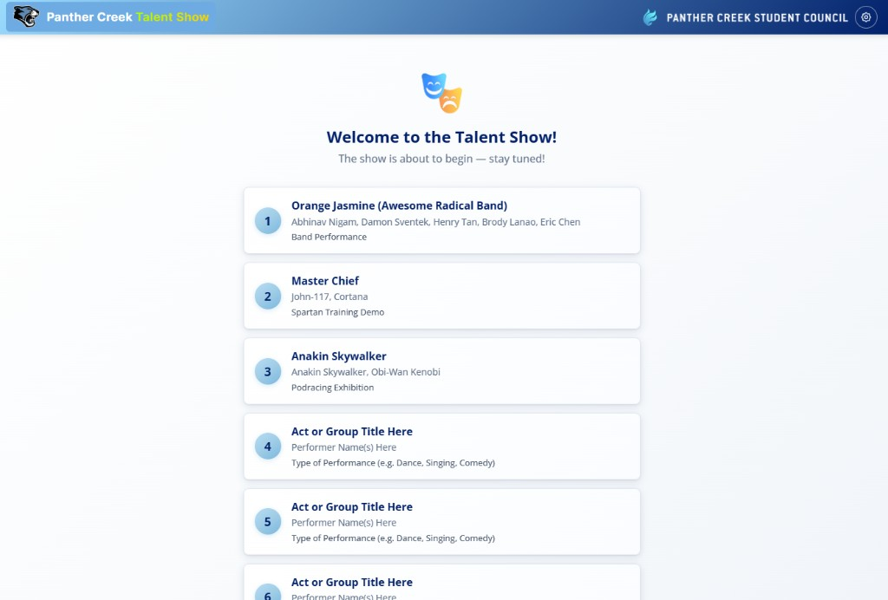
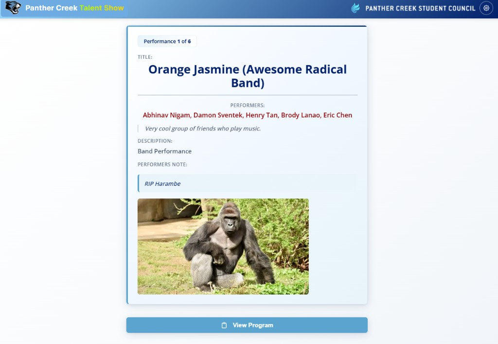
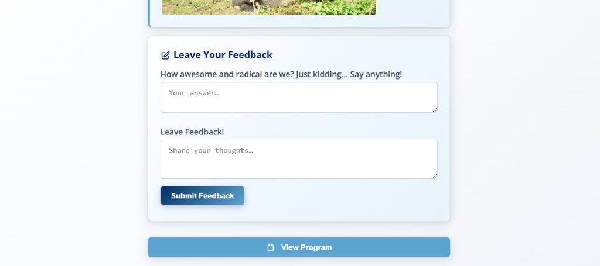
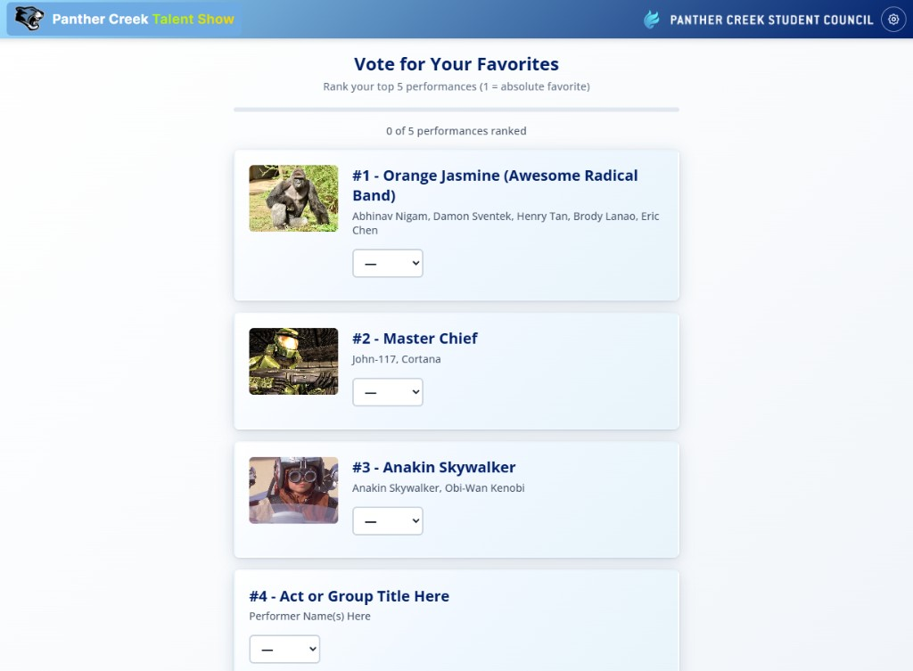
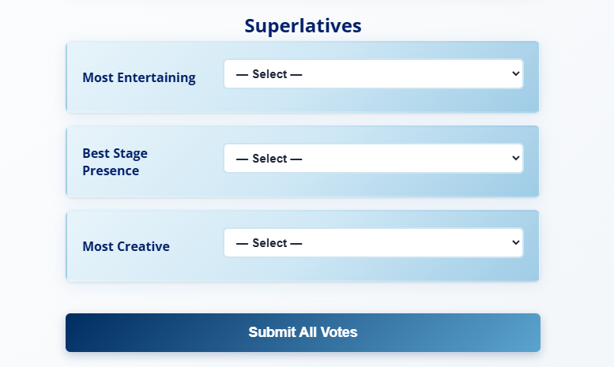
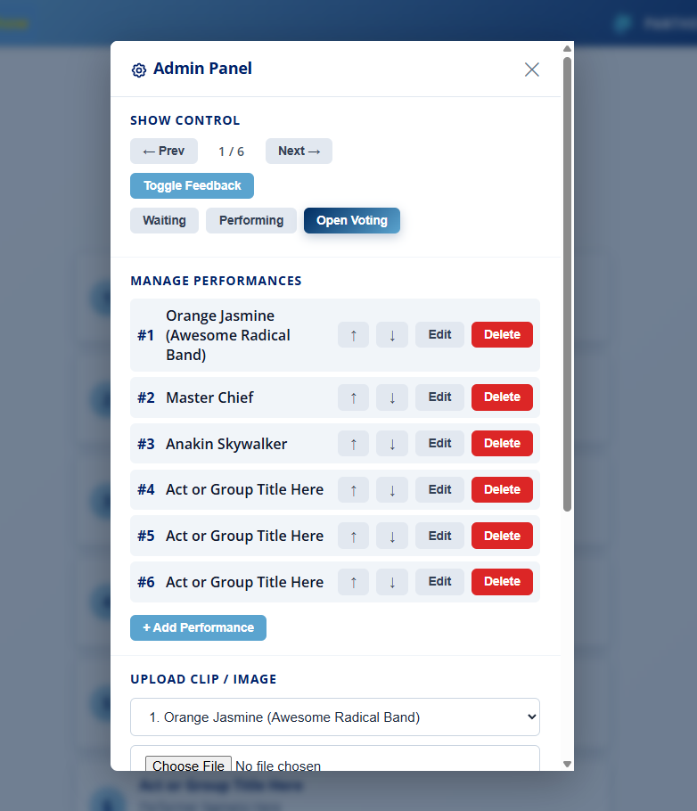
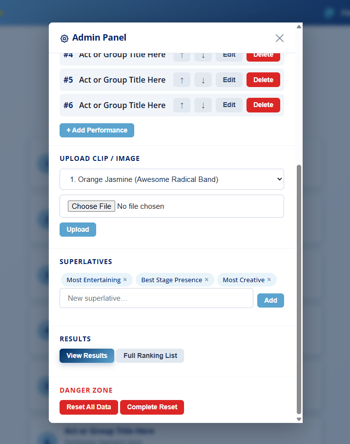
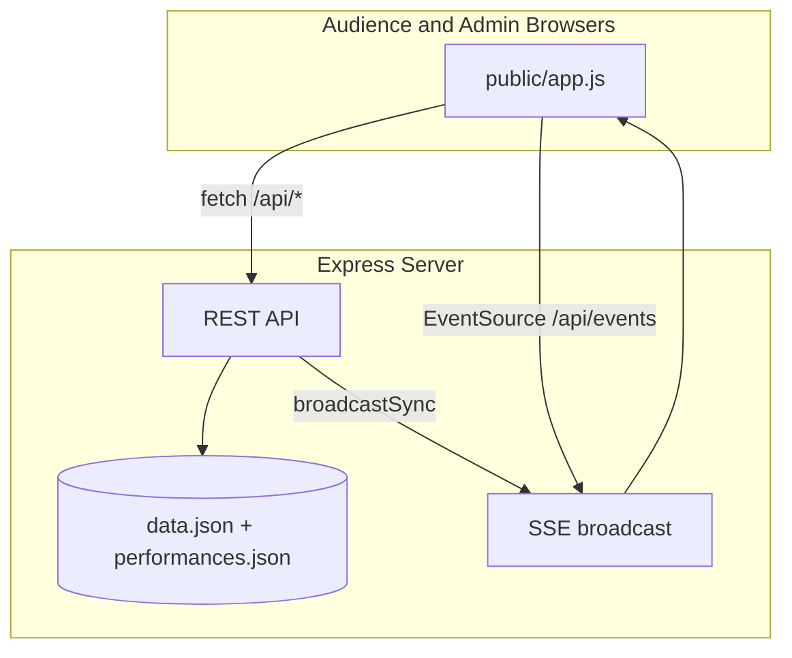

# Talent Show Voting App

I built this to run a live school talent show for about 100 people — audience phones follow an admin-controlled flow (waiting → performing → voting) with ranked votes, superlatives, per-performance feedback, and live results. This is the production codebase I deployed in 2026, cleaned up for anyone who wants to run something similar.

If you're organizing a talent show, assembly vote, or any event where a crowd votes from their phones while one person runs the show, you can fork this repo, edit `performances.json`, start the server, and go. Everything syncs in real time over SSE so every device stays on the same act and phase.

> **Disclaimer:** Not affiliated with WCPSS or Panther Creek High School.

## What's in this repo

The sample program includes one real act from the show I ran (**Orange Jasmine**) plus demo entries and labeled placeholders (`Act or Group Title Here`, etc.) so you can swap in your own lineup. I removed other performers' personal data from the public version. Admin access requires an `ADMIN_PASSWORD` environment variable — no hardcoded secrets in the code.

## Screenshots

The screens below follow the show flow: program → live performance → feedback → voting → admin.

### Audience — live program (waiting phase)

Before the show starts, every connected device sees the same synced program list. Performances update in real time as the admin edits or reorders acts.



### Audience — live performance view

During the **Performing** phase, all audience devices follow the admin's current act — performers, description, optional notes, and uploaded media (images or clips).



The `1 of 6` badge matches the admin's position in the lineup. When the admin hits Next, every phone updates together.

### Audience — per-performance feedback

While an act is on stage, the admin can open feedback. Audience members answer optional custom questions and leave comments without leaving the performance screen.



### Audience — ranked voting

When the admin opens voting, audience members rank their **top 5** performances (1 = favorite). Thumbnails come from uploaded media on each act.



### Audience — superlatives

Below the rankings, voters pick one performer per superlative category (e.g. Most Entertaining, Best Stage Presence). Categories are configurable from the admin panel.



One **Submit All Votes** sends rankings and superlatives together. Duplicate votes are blocked by device fingerprint, cookie, and name checks.

### Admin — show control & performance management

The admin panel drives the entire event. **Show Control** advances phases (Waiting → Performing → Open Voting), moves between acts, and toggles feedback — all broadcast instantly to every audience phone.



**Manage Performances** supports adding, editing, deleting, and reordering acts without editing JSON by hand.

### Admin — uploads, superlatives, and results

Media uploads (clips/images per act), superlative categories, live results, and reset options for the next run.



---

## Run your own show

1. **Install and start** the server with `ADMIN_PASSWORD` set (see [Run locally](#run-locally)).
2. **Edit the lineup** in `performances.json` — replace the placeholder acts with yours.
3. **Audience:** open the site on any phone, enter first and last name, and wait on the program screen.
4. **Admin:** click the gear icon and enter the admin password. The first device to log in becomes the **owner** with full panel access.
5. **During the show:** use Prev/Next and phase buttons; audience screens follow automatically.
6. **Voting:** open voting from admin; audience rank performances and pick superlatives, then view results from the admin panel.

## Features

**Audience**

- Join with first/last name and device fingerprint
- Live program list with intermission indicator
- Synced performance view (follows admin Next / phase changes)
- Per-performance feedback
- Ranked voting (top 5) + superlatives
- "Already voted" state with optional next-show feedback

**Admin**

- Single-owner admin panel (password-protected)
- Phase control: Waiting, Performing, Open Voting
- Performance CRUD and reorder
- Media upload (local disk or Tigris S3)
- Results: top 3, full rankings, voter list
- Reset data / complete reset (forces re-login on all devices)

**Technical**

- Server-Sent Events (SSE) for live sync across devices
- Polling fallback + revision timestamps to avoid stale state
- Multi-layer vote deduplication (cookie, fingerprint, hardware fingerprint, name)
- JSON file persistence with optional Fly.io volume at `/data`

## Tech stack

- **Backend:** Node.js, Express
- **Frontend:** Vanilla HTML/CSS/JS
- **Realtime:** SSE (`/api/events`)
- **Storage:** JSON files (`data.json`, `performances.json`); optional AWS S3-compatible (Tigris) for uploads
- **Deploy:** Fly.io (single machine + persistent volume)

## Architecture



Admin actions update the database, bump a revision timestamp, and push an atomic `sync` payload to all connected clients.

## Run locally

```bash
npm install
```

**Windows (PowerShell):**

```powershell
$env:ADMIN_PASSWORD="your-secret-password"
npm start
# or if port 3000 is busy:
npm run dev:3001
```

**macOS / Linux:**

```bash
ADMIN_PASSWORD=your-secret-password npm start
PORT=3001 npm start   # alternate port
```

Open [http://localhost:3000](http://localhost:3000) (or `:3001`).

Sample performances are in `performances.json`. Runtime state is written to `data.json` (created on first run, gitignored).

## Deploy (optional)

1. Install [Fly CLI](https://fly.io/docs/hands-on/install-flyctl/) and log in
2. Set secret: `fly secrets set ADMIN_PASSWORD=your-secret-password -a your-app`
3. Configure a volume mount at `/data` (see `fly.toml`)
4. `fly deploy`

Scale to zero when not in use: `fly scale count 0 -a your-app`

## What I'd improve next

- Voting edge cases: occasional false "already voted" from hardware fingerprint collisions at a shared venue
- `Unknown` voter names when a vote arrives without a matching device join record
- Stronger admin session handling without relying on a single device owner
- Automated tests for sync revision logic and vote deduplication
- UI polish (layout, mobile refinements)

## License

MIT — see [LICENSE](LICENSE).
